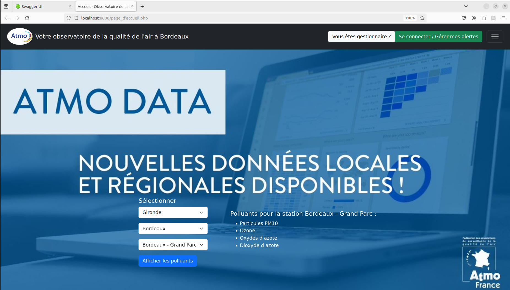
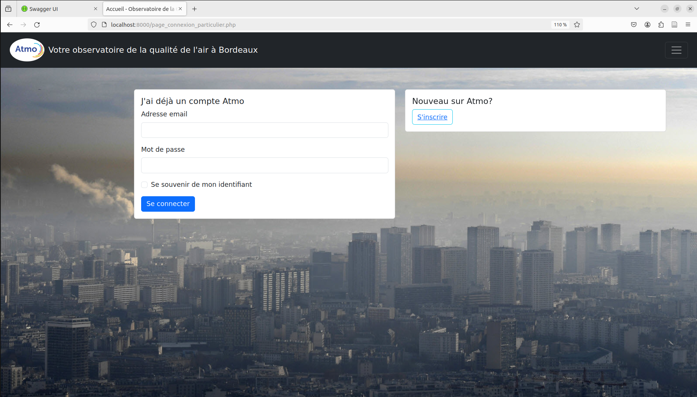
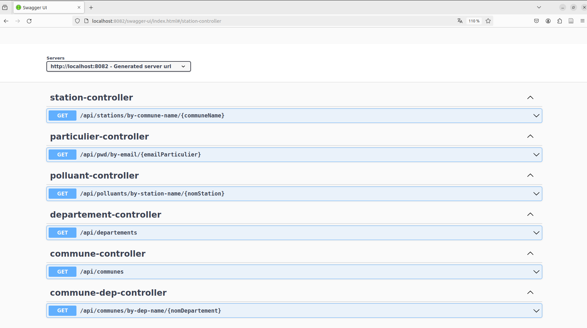

# Application Web de Gestion de la Qualité de l'Air

Cette application web vise à répondre aux besoins d'un observatoire régional chargé de la qualité de l'air en simplifiant et en automatisant la gestion des données. Elle offre aux particuliers la possibilité de consulter des informations sur la qualité de l'air et de recevoir des alertes, tandis que pour les gestionnaires, elle facilite l'accès et la modification des données clés, contribuant ainsi à la mise en œuvre efficace des politiques de prévention.

## Fonctionnement du Projet

Le projet est développé en utilisant une architecture MVC (Modèle-Vue-Contrôleur) :

- **Modèle** : Le modèle représente la structure des données de l'application. Dans notre projet, le modèle est géré à l'aide d'une base de données PostgreSQL. Les données sont organisées selon les besoins de l'application, telles que les informations sur les utilisateurs, les seuils de polluants, les décrets, les stations de surveillance, etc.

- **Vue** : La vue est responsable de l'interface utilisateur. Dans notre projet, les vues sont créées à l'aide de HTML5, CSS3 et Bootstrap. Elles fournissent une interface conviviale pour les utilisateurs, où ils peuvent interagir avec les fonctionnalités de l'application.

- **Contrôleur** : Le contrôleur agit comme un intermédiaire entre le modèle et la vue. Il gère les requêtes des utilisateurs, traite les données provenant du modèle, et les transmet à la vue pour affichage. Dans notre projet, les contrôleurs sont implémentés à l'aide de PHP.

Les différentes fonctionnalités de l'application sont implémentées en utilisant des API RESTful, qui fournissent des points d'accès pour interagir avec les données de l'application. Ces API sont développées à l'aide du framework Spring pour Java.

## Captures d'écran

1. Page d'Accueil

2. Page de Connexion Particulier

3. API sur Spring

## Rapport du Projet

Le rapport complet du projet, décrivant en détail les spécifications fonctionnelles, les profils d'utilisateurs, les fonctionnalités, les technologies utilisées, ainsi que les moyens mis en œuvre pour assurer la sécurité, la flexibilité du code, l'architecture et les règles d'écriture, est disponible dans le fichier [Rapport_Projet.pdf](rapport/Rapport_Projet.pdf).
